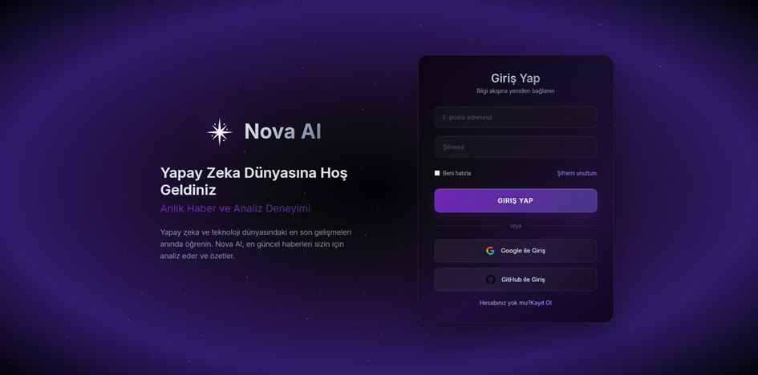

# Nova AI - Akıllı Haber Asistanı

Nova AI, yapay zeka ve teknoloji dünyasındaki baş döndürücü bilgi akışını takip etmeyi kolaylaştıran, sohbet tabanlı, akıllı bir web uygulamasıdır. Kullanıcıların doğal dil ile en güncel haberlere ulaşmasını ve bu haberlerin yapay zeka tarafından analiz edilmiş özetlerini almasını sağlar.

**Canlı Demo:** https://novaai-vwml.onrender.com




## Projenin Amacı ve Çözdüğü Sorun

Yapay zeka dünyası baş döndürücü bir hızla gelişiyor. Her gün yeni bir model, yeni bir teknik veya çığır açan bir gelişme duyuruluyor. Bu bilgi selini bir profesyonel olarak bile takip etmek neredeyse imkansız hale geldi. Birçok farklı haber sitesini, blogu ve teknik makaleyi taramak, değerli zamanın kaybolmasına neden oluyor.

**Nova AI, tam olarak bu soruna bir çözüm sunmak için doğdu.**

Bu projenin temel amacı, yapay zeka ve teknoloji alanındaki bilgi akışını basitleştirmek, kişiselleştirmek ve hızlandırmaktır. Kullanıcıların (ve bizzat benim gibi geliştiricilerin) dağınık kaynaklar arasında kaybolmak yerine, ihtiyaç duydukları en güncel ve en önemli bilgilere tek bir yerden, sohbet kolaylığında ve yapay zeka tarafından özetlenmiş bir şekilde ulaşmasını sağlamaktır.

## Temel Özellikler

**Doğal Dil Anlama:** "Son 3 gündeki haberler" veya "GPT-5 hakkında bilgi ver" gibi komutları anlar ve işler.

**Otonom Haber İşleme Hattı:** Web'den sürekli olarak güncel haberleri çeker, temizler, özetler ve veritabanını taze tutar.

**Akıllı Özetleme:** Her makalenin özü, OpenAI GPT-4o Mini tarafından analiz edilerek Türkçe ve anlaşılır bir formatta sunulur.

**Dinamik ve İnteraktif Arayüz:** Gelen cevaplar, modern ve kullanıcı dostu haber kartları şeklinde sunulur.

**Güvenilir ve Ölçeklenebilir Altyapı:** Canlı ortamda PostgreSQL veritabanı ile kalıcı ve güvenli veri depolaması sağlar.

## Nasıl Çalışır? Zeki ve Otonom Veri Hattı

Projenin kalbinde, sürekli güncel kalmayı sağlayan akıllı ve otonom bir veri işleme boru hattı yatmaktadır:

**1. Veri Toplama (Ingestion):** Arka planda çalışan servis, teknoloji haber kaynaklarını yorulmak bilmeden tarayarak yeni makaleleri tespit eder. asyncio.gather kullanımı sayesinde birden çok makale eş zamanlı olarak işlenir, bu da süreci inanılmaz derecede hızlandırır.

**2. İçerik Saflaştırma:** Bir makale bulunduğunda, ham HTML içeriği Trafilatura kütüphanesi ile analiz edilir. Sayfadaki reklam, menü, script gibi tüm gürültüden arındırılarak sadece saf ve temiz makale metni elde edilir.

**3. Yapay Zeka Destekli Özetleme:** İşte sihrin gerçekleştiği yer burasıdır. Saflaştılmış metin, LangChain orkestrasyonu ile OpenAI GPT-4o Mini modeline gönderilir. Model, binlerce kelimelik bir makaleyi analiz eder ve onun en can alıcı noktalarını içeren, 50-75 kelimelik, tamamen Türkçe bir özet üretir.

**4. Kalıcı Hafızaya Kayıt:** Bu değerli bilgi (başlık, kaynak, URL ve en önemlisi yapay zeka tarafından üretilen özet), SQLAlchemy aracılığıyla projenin kalıcı hafızası olan PostgreSQL veritabanına kaydedilir.

**5. Kullanıcı Etkileşimi ve Hibrit Ajan Mimarisi:** Bir kullanıcı sohbet ekranına bir soru yazdığında, istek FastAPI sunucusuna ulaşır. Burada, LangChain'in modern ve verimli bir hibrit ajan mimarisi devreye girer:

#### Planlama
LLM, tam bir "Agent Executor" gibi çalışmak yerine, sadece bir "planlayıcı" görevi görür. Kullanıcının niyetini anlar ve hangi veritabanı aracının (`get_recent_news` veya `search_news_by_topic`) hangi parametrelerle çağrılacağına karar verir.

#### Yürütme
LLM'in oluşturduğu bu "plan", Python koduna geri döner. Veritabanı sorgusu gibi kritik işlemler, LLM tarafından değil, doğrudan bizim kontrolümüz altındaki kod tarafından yürütülür. Bu ileri seviye yaklaşım, LLM'in halüsinasyon riskini ortadan kaldırır, maliyetleri düşürür ve tüm süreci daha güvenilir ve öngörülebilir hale getirir.

### 6. Dinamik Cevap Üretimi ve Sunum
Veritabanından gelen makale listesi, React arayüzünün kolayca anlayabileceği özel bir Markdown formatına dönüştürülerek kullanıcıya gönderilir. Arayüz, bu metni akıllıca ayrıştırır; eğer bir haber listesi ise her bir makaleyi şık bir NewsCard bileşeni olarak, değilse standart bir metin mesajı olarak ekrana basar.

## Mimarisi ve Kullanılan Teknolojiler

**Frontend:** React.js, React Markdown, CSS

**Backend:** FastAPI (Python), LangChain, OpenAI GPT-4o Mini, SQLAlchemy, Trafilatura

**Veritabanı:** PostgreSQL (Canlı Ortam), SQLite (Yerel Geliştirme)

**Deployment:** Render (Web Servisi & PostgreSQL), GitHub (Sürüm Kontrolü)

## Kurulum

### Gereksinimler
- Python 3.8+
- Node.js 14+
- PostgreSQL (opsiyonel, yerel geliştirme için SQLite kullanılabilir)

### Backend Kurulumu
```bash
# Proje dizinine git
cd nova-ai-backend

# Sanal ortam oluştur
python -m venv venv

# Sanal ortamı etkinleştir
# Windows:
venv\Scripts\activate
# macOS/Linux:
source venv/bin/activate

# Bağımlılıkları yükle
pip install -r requirements.txt

# Çevre değişkenlerini ayarla
cp .env.example .env
# .env dosyasını düzenle ve gerekli API anahtarlarını ekle

# Veritabanı migrasyonlarını çalıştır
python -m alembic upgrade head

# Sunucuyu başlat
uvicorn main:app --reload
```

### Frontend Kurulumu
```bash
# Frontend dizinine git
cd nova-ai-frontend

# Bağımlılıkları yükle
npm install

# Geliştirme sunucusunu başlat
npm start
```

## Kullanım

1. Uygulamaya giriş yapın
2. Sohbet alanına doğal dil komutlarınızı yazın:
   - "Son 3 gündeki haberler"
   - "GPT-5 hakkında bilgi ver"
   - "OpenAI ile ilgili son gelişmeler"
3. Nova AI sizin için en güncel haberleri bulacak ve özetleyecek

## Katkıda Bulunma

1. Bu repository'yi fork edin
2. Feature branch oluşturun (`git checkout -b feature/AmazingFeature`)
3. Değişikliklerinizi commit edin (`git commit -m 'Add some AmazingFeature'`)
4. Branch'inizi push edin (`git push origin feature/AmazingFeature`)
5. Pull Request oluşturun


